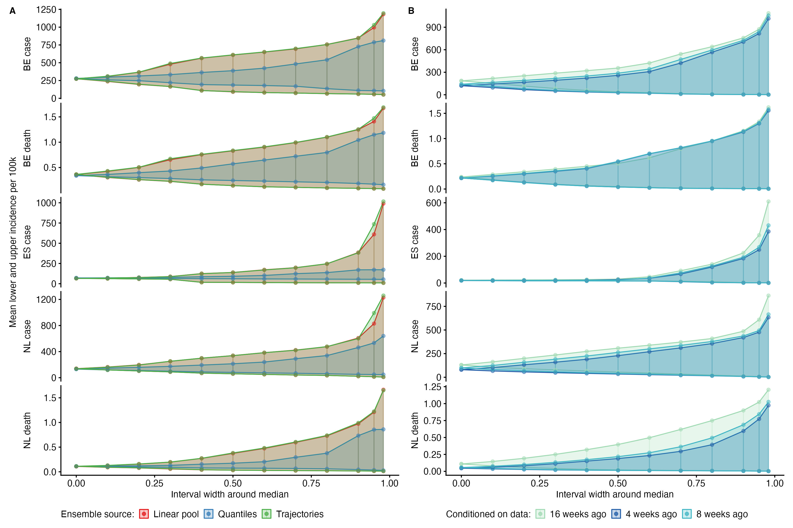
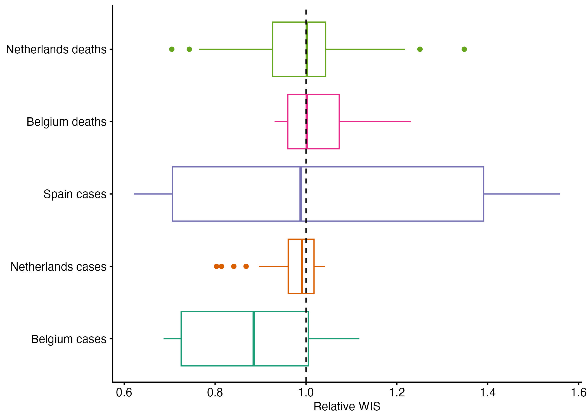

# Supplementary Information

## SI Figure 1


SI Figure 1. Mean central prediction intervals at increasing distances from the median. The 52-week mean of incidence per 100,000 population across all time points and scenarios, showing mean central prediction intervals at increasing distances from the median (interval width), by aggregation method (A) or weighting (B). The median estimate for each ensemble has 0 interval width (x-axis), with uncertainty increasing until an interval width at 0.98 represents the 1%-99% credibility interval around the median.
 
## SI Figure 2



SI Figure 2. Distribution of forecast performance scores (relative WIS), of forecasts from model trajectories weighted using 0 through 31 weeks' available data. Performance is compared to an unweighted ensemble (reference line at 1).


## SI Table 1

```{r contributors, echo=FALSE, warning=FALSE, message=FALSE}
library(here)
library(dplyr)
library(purrr)
source(here("code", "import-results.R"))

results <- import_projections(round = 2, local = TRUE, n_model_min = 3) 
models <- unique(results$model)
mtd <- map_dfr(models,
           ~ yaml::read_yaml(paste0("https://raw.githubusercontent.com/covid19-forecast-hub-europe/covid19-scenario-hub-europe/main/model-metadata/", .x, ".yml")) |> 
             unlist()) |> 
  mutate(team_name = paste0("**", team_name, "**", "\n", model_abbr)) |> 
  select(Team = team_name, Methods = methods)

knitr::kable(mtd)
```
SI Table 1. Teams that contributed models to Round 2 of the European Scenario Hub, with self-described methods and links to further information. See also: 

- Full model metadata, at: https://github.com/covid19-forecast-hub-europe/covid19-scenario-hub-europe/tree/main/model-metadata
- Information about each model's assumptions for Round 2, at: https://github.com/covid19-forecast-hub-europe/covid19-scenario-hub-europe/tree/main/model-abstracts/2022-07-24 

# Round 2 report

The following pages are the original website reporting for the European Scenario Hub Round 2 as of July 2022. 

The report is currently (January 2023) available at: https://covid19scenariohub.eu/report2.html

Code to generate this report is available at: https://github.com/european-modelling-hubs/covid19-scenario-hub-europe-website/blob/main/report2.Rmd

